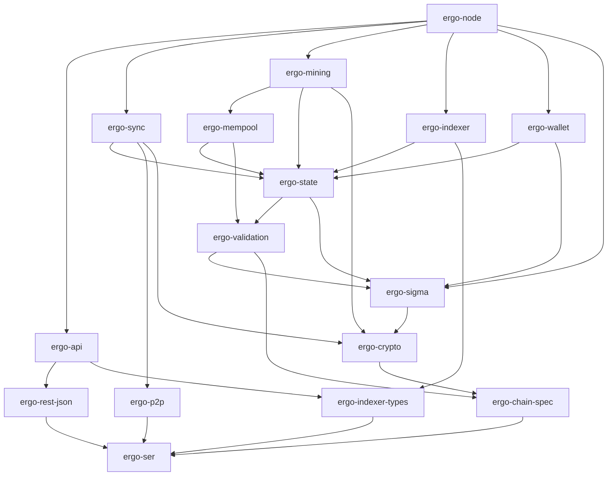

# Codebase map

A landmark map of the 18-crate workspace (~197K lines of Rust code). Every crate
has a detailed page under [`codemap/`](./codemap/) — purpose, module-by-module
responsibilities, key public types/traits/functions, owned invariants, and a
"start here." This index is the front door: find the crate, then open its page.

The goal is navigation by *lookup*, not by reading. If a claim here disagrees
with the code, the code wins.

## Layers

The workspace is a strict dependency DAG (no cycles), listed foundation-first.
**Every crate depends on `ergo-primitives` and (above L0) `ergo-ser`** — those
universal edges are omitted below and in the graph for clarity.

| Layer | Crate | src LOC | Responsibility |
|---|---|--:|---|
| **L0** Foundation | [ergo-primitives](./codemap/ergo-primitives.md) | 2.6K | Byte-level types + codecs: Blake2b256, `Digest32`/`ModifierId`/`ADDigest`, VLQ/zigzag readers/writers, the JIT cost model. No curve math, no consensus serializers. |
| **L1** Wire format | [ergo-ser](./codemap/ergo-ser.md) | 16K | Byte-exact, round-trippable codecs for every consensus structure (headers, txs, boxes, ErgoTree + opcode AST, sigma type/value, PoW, NiPoPoW). Bytes↔structs only — every content-addressed ID originates here. |
| **L2** Chain & crypto | [ergo-chain-spec](./codemap/ergo-chain-spec.md) | 1.1K | Per-network params: magic, address prefix, difficulty/voting/monetary/reemission schedules, genesis identity, seed peers. Constants + constructors only. |
| **L2** | [ergo-crypto](./codemap/ergo-crypto.md) | 1.9K | Autolykos v1/v2 PoW verification, difficulty-retarget math (incl. EIP-37), Blake2b256 Merkle trees. No interpreter, no state. |
| **L3** Interpreter | [ergo-sigma](./codemap/ergo-sigma.md) | 15K | AST-walking ErgoTree evaluator + sigma-protocol verifier (Schnorr DLog, ProveDHTuple, CAND/COR/threshold) with JIT cost. The "may this input be spent?" decision. |
| **L4** Consensus rules | [ergo-validation](./codemap/ergo-validation.md) | 15K | Header/block/tx legality: structural/monetary/script/cost checks, voted-param epoch recomputation, NiPoPoW verify. Emits unforgeable `Checked*` proofs. No storage or fork-choice. |
| **L5** State | [ergo-state](./codemap/ergo-state.md) | 33K | redb-backed authenticated UTXO state: in-memory AVL+ tree, atomic `apply_block`/`rollback_to` (delta-based reorg), header/section chain index, voted params, Mode 2/3 + Mode 5 digest backend. |
| **L5** Wallet | [ergo-wallet](./codemap/ergo-wallet.md) | 8.9K | HD wallet: BIP39/BIP32, encrypted secret storage (Scala-compatible), native sigma-proof signing (single + multi-sig hints), tx building, box selection. Ships the `ergo-wallet` CLI. |
| **L6** Subsystems | [ergo-mempool](./codemap/ergo-mempool.md) | 8.0K | Single-writer mempool: 17-step admission, weight-ordered pool, anti-DoS budgets, pool-aware UTXO overlay, reorg demotion/revalidation. Consensus checks delegated to `ergo-validation`. |
| **L6** | [ergo-p2p](./codemap/ergo-p2p.md) | 8.8K | P2P transport: TCP frame codec, handshake + feature negotiation, message codecs, per-peer state/scoring, peer manager (eviction/anti-eclipse), address book, modifier delivery. Wire + accounting only. |
| **L6** | [ergo-sync](./codemap/ergo-sync.md) | 8.5K | Header-first sync: a pure `SyncCoordinator` (peer events → `Action`s) + a stateful `SyncExecutor` (validate + persist via `ergo-state`) + UTXO-snapshot (Mode 2) and NiPoPoW bootstrap reducers. |
| **L6** | [ergo-mining](./codemap/ergo-mining.md) | 9.1K | External-miner block production: candidate assembly (coinbase + emission/reemission, mempool selection, optional zero-fee storage-rent self-claim, AVL dry-run), Autolykos v2 work messages, solution apply. |
| **L6** | [ergo-indexer](./codemap/ergo-indexer.md) | 11K | Opt-in `/blockchain/*` extra-index (writer half): per-block box/tx/address/template/token rows, atomic apply + delta rollback, storage-rent eligibility index, tip-following poller. Requires Mode 1. |
| **L7** API & DTOs | [ergo-api](./codemap/ergo-api.md) | 15K | Operator-facing read-mostly axum HTTP server: Scala-compat surface + `/api/v1/*` dashboard + embedded UIs. Talks to the node **only** through `Arc<dyn …>` trait bridges; never reaches into node internals. |
| **L7** | [ergo-rest-json](./codemap/ergo-rest-json.md) | 1.4K | JSON↔canonical-wire-bytes DTOs for the Scala-compat REST. The canonicalizing decoders reproduce Scala's bytes exactly so content-addressed IDs verify (anchored by the `b4_*` byte-parity oracle). |
| **L7** | [ergo-indexer-types](./codemap/ergo-indexer-types.md) | 0.5K | Reader-side surface of the extra-index: the `IndexerQuery` trait + return DTOs, split out so `ergo-api` consumes the read surface without depending on redb / `ergo-state`. |
| **L8** Runtime | [ergo-node](./codemap/ergo-node.md) | 33K | The binary + runtime: wires every crate into one supervised tokio runtime, owns lifecycle (config, data-dir, genesis, shutdown) and the **single-writer action loop**, and bridges to `ergo-api` via a lock-free `ArcSwap` snapshot. |
| **Dev** Tooling | [ergo-difftest](./codemap/ergo-difftest.md) | 7.5K | Invariant + differential fuzz harness: byte-stream generators, structured mutators, oracle-free checks (no-panic, parse→serialize fixed-point), JVM-oracle accept/reject parity. Dev-only; not in the node binary DAG. |

## Dependency graph

Universal edges to `ergo-primitives`/`ergo-ser` are omitted; arrows read
"depends on."

## Where do I find…?

| I'm looking for… | Start in |
|---|---|
| A consensus ID or wire format (`header_id`, `tx_id`, `box_id`, `section_id`) | [ergo-ser](./codemap/ergo-ser.md) |
| "Is this header / block / tx legal?" | [ergo-validation](./codemap/ergo-validation.md) (+ [ergo-sigma](./codemap/ergo-sigma.md) for the script verdict) |
| The UTXO set, AVL+ tree, reorgs, persistence | [ergo-state](./codemap/ergo-state.md) |
| Proof-of-work / difficulty | [ergo-crypto](./codemap/ergo-crypto.md) |
| Block production / the mining API | [ergo-mining](./codemap/ergo-mining.md) |
| Mempool admission / ordering | [ergo-mempool](./codemap/ergo-mempool.md) |
| Peer networking / the wire protocol | [ergo-p2p](./codemap/ergo-p2p.md) (driven by [ergo-sync](./codemap/ergo-sync.md)) |
| Chain sync / IBD / bootstrap | [ergo-sync](./codemap/ergo-sync.md) |
| REST endpoints | [ergo-api](./codemap/ergo-api.md) (+ [ergo-rest-json](./codemap/ergo-rest-json.md), and [ergo-indexer](./codemap/ergo-indexer.md) for `/blockchain/*`) |
| Wallet / signing | [ergo-wallet](./codemap/ergo-wallet.md) |
| Boot, config, the action loop, mode selection | [ergo-node](./codemap/ergo-node.md) |

## Keeping it current

Each `codemap/<crate>.md` page is verified against that crate's source. When a
crate's public surface or owned invariants change materially, update its page;
this index changes only when crates are added/removed or dependencies shift. See
[`../ARCHITECTURE.md`](../ARCHITECTURE.md) for the cross-crate big picture
(data-flow paths, the single-writer model, consensus/persistence/reorg
contracts).
