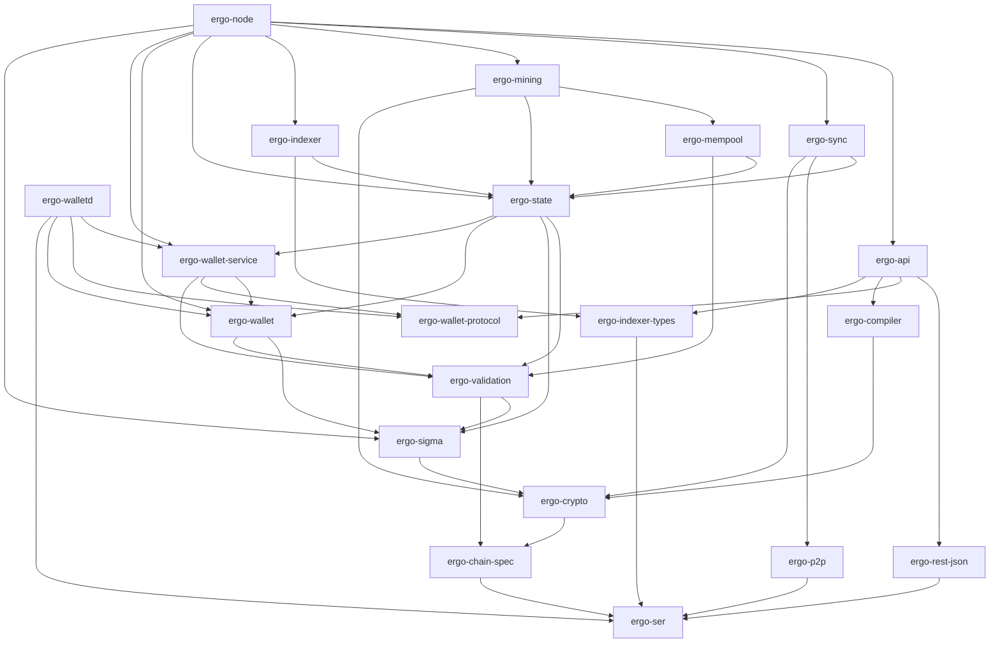

# Codebase map

A landmark map of the 22-crate workspace. Every crate has a detailed page
under [`codemap/`](./codemap/) — purpose, module-by-module responsibilities,
key public types/traits/functions, owned invariants, and a “start here.”
This index is the front door: find the crate, then open its page.

The goal is navigation by *lookup*, not by reading. If a claim here disagrees
with the code, the code wins.

## Layers

The workspace is a strict dependency DAG (no cycles), listed foundation-first.
The graph below shows the important workspace edges; the many direct edges to
`ergo-primitives` and `ergo-ser` are omitted for clarity, but they are not
universal: `ergo-wallet-protocol` intentionally has neither.

| Layer | Crate | src LOC | Responsibility |
|---|---|--:|---|
| **L0** Foundation | [ergo-primitives](./codemap/ergo-primitives.md) | 2.6K | Byte-level types + codecs: Blake2b256, `Digest32`/`ModifierId`/`ADDigest`, VLQ/zigzag readers/writers, the JIT cost model. No curve math, no consensus serializers. |
| **L1** Wire format | [ergo-ser](./codemap/ergo-ser.md) | 16K | Byte-exact, round-trippable codecs for every consensus structure (headers, txs, boxes, ErgoTree + opcode AST, sigma type/value, PoW, NiPoPoW). Bytes↔structs only — every content-addressed ID originates here. |
| **L2** Chain & capability | [ergo-chain-spec](./codemap/ergo-chain-spec.md) | 1.1K | Per-network params: magic, address prefix, difficulty/voting/monetary/reemission schedules, genesis identity, seed peers. Constants + constructors only. |
| **L2** | [ergo-crypto](./codemap/ergo-crypto.md) | 1.9K | Autolykos v1/v2 PoW verification, difficulty-retarget math (incl. EIP-37), Blake2b256 Merkle trees. No interpreter, no state. |
| **L2** Protocol | [ergo-wallet-protocol](./codemap/ergo-wallet-protocol.md) | 2.5K | Transport-neutral wallet and node-chain wire DTOs, ID/byte validation, and native/Scala response shapes. No storage, node, or async runtime. |
| **L3** Interpreter | [ergo-sigma](./codemap/ergo-sigma.md) | 15K | AST-walking ErgoTree evaluator + sigma-protocol verifier with JIT cost. The “may this input be spent?” decision. |
| **L3** | [ergo-compiler](./codemap/ergo-compiler.md) | 25K | ErgoScript source → ErgoTree compiler with Scala byte-parity. A consensus-adjacent capability, not a storage or transport layer. |
| **L3** Validation | [ergo-validation](./codemap/ergo-validation.md) | 15K | Header/block/tx legality, voted-param epochs, and NiPoPoW verification. |
| **L4** Wallet core | [ergo-wallet](./codemap/ergo-wallet.md) | 7.0K | HD cryptography and secret storage: BIP39/BIP32, P2PK addresses, sigma-proof signing, and the wallet CLI. |
| **L4** | [ergo-wallet-service](./codemap/ergo-wallet-service.md) | 9.2K | Service-owned wallet persistence/runtime core: state, redb store, apply/rescan/sync, box selection, and transaction construction. |
| **L5** State | [ergo-state](./codemap/ergo-state.md) | 35K | Redb-backed authenticated UTXO state, AVL+ tree, atomic apply/rollback, chain index, voted parameters, and snapshot/pruning backends. Keeps a transitional wallet facade over `ergo-wallet-service`. |
| **L6** Subsystems | [ergo-mempool](./codemap/ergo-mempool.md) | 8.0K | Single-writer mempool: admission, weight ordering, anti-DoS budgets, UTXO overlay, and reorg revalidation. |
| **L6** | [ergo-p2p](./codemap/ergo-p2p.md) | 8.8K | P2P transport: framing, handshake, message codecs, peer accounting, and modifier delivery. |
| **L6** | [ergo-sync](./codemap/ergo-sync.md) | 8.5K | Header-first sync coordinator/executor, UTXO-snapshot and NiPoPoW bootstrap reducers. |
| **L6** | [ergo-mining](./codemap/ergo-mining.md) | 9.1K | External-miner candidate assembly and solution application. |
| **L6** | [ergo-indexer](./codemap/ergo-indexer.md) | 11K | Optional extra-index writer for `/blockchain/*`, with atomic apply/rollback. |
| **L7** API & DTOs | [ergo-api](./codemap/ergo-api.md) | 15K | Axum HTTP server for Scala-compatible and native API routes; consumes protocol DTOs through `Arc<dyn …>` traits. |
| **L7** | [ergo-rest-json](./codemap/ergo-rest-json.md) | 1.4K | JSON↔canonical-wire DTOs for the Scala-compat REST surface. |
| **L7** | [ergo-indexer-types](./codemap/ergo-indexer-types.md) | 0.5K | Reader-side extra-index traits and DTOs, split out so the API does not depend on redb/state. |
| **L8** Runtime | [ergo-node](./codemap/ergo-node.md) | 53K | Binary and embedded/API adapter: wires components, owns process lifecycle and the single-writer action loop, and hosts the wallet writer while delegating wallet core work to the service. |
| **L8** Runtime | [ergo-walletd](./codemap/ergo-walletd.md) | 4.8K | Standalone watch-only wallet daemon: its own redb store, an HTTP chain client, a bounded sync/reorg loop, and a read-only local API on a Unix socket or loopback TCP. Hosts the embedded-vs-daemon **shadow harness** that proves the two wallet apply paths agree. No secrets, no signing, no submit. |
| **Dev** Tooling | [ergo-difftest](./codemap/ergo-difftest.md) | 7.5K | Dev/test-only differential and fuzz harness over wire decoders and generators. |

## Dependency graph

Important workspace edges are shown; arrows read “depends on.”

```mermaid
graph TD
  chainspec[ergo-chain-spec] --> ser[ergo-ser]
  crypto[ergo-crypto] --> chainspec
  sigma[ergo-sigma] --> crypto
  compiler[ergo-compiler] --> crypto
  validation[ergo-validation] --> sigma
  validation --> chainspec
  protocol[ergo-wallet-protocol]
  wallet[ergo-wallet] --> sigma
  wallet --> validation
  service[ergo-wallet-service] --> wallet
  service --> protocol
  service --> validation
  state[ergo-state] --> validation
  state --> sigma
  state --> wallet
  state --> service
  mempool[ergo-mempool] --> state
  mempool --> validation
  p2p[ergo-p2p] --> ser
  sync[ergo-sync] --> state
  sync --> p2p
  sync --> crypto
  mining[ergo-mining] --> mempool
  mining --> state
  mining --> crypto
  indexertypes[ergo-indexer-types] --> ser
  indexer[ergo-indexer] --> state
  indexer --> indexertypes
  restjson[ergo-rest-json] --> ser
  api[ergo-api] --> restjson
  api --> protocol
  api --> compiler
  api --> indexertypes
  node[ergo-node] --> api
  node --> sync
  node --> mining
  node --> indexer
  node --> state
  node --> wallet
  node --> service
  node --> sigma
  walletd[ergo-walletd] --> service
  walletd --> protocol
  walletd --> wallet
  walletd --> ser
```

## Dependency boundaries

- **`ergo-wallet-protocol`:** normal dependencies are limited to `serde`,
  `serde_json`, and `hex`. It is transport-neutral and intentionally does not
  depend on any Ergo workspace crate, `redb`, `tokio`, `axum`, or `utoipa`.
- **`ergo-wallet`:** normal workspace dependencies are `ergo-primitives`,
  `ergo-ser`, `ergo-sigma`, and `ergo-validation`; it does not depend on
  `ergo-state`, `ergo-wallet-service`, `ergo-wallet-protocol`, `ergo-api`, or
  `ergo-node`.
- **`ergo-wallet-service`:** normal direct dependencies are
  `ergo-wallet`, `ergo-wallet-protocol`, `ergo-primitives`, `ergo-ser`,
  `ergo-validation`, `serde`, `serde_json`, `hex`, `thiserror`, `redb`, and
  `bincode`. It intentionally has no direct `ergo-sigma` edge; sigma types
  are consumed transitively through the wallet and validation crates. It must
  not depend on `ergo-state`, `ergo-api`, `ergo-node`,
  `ergo-mempool`, `ergo-mining`, `ergo-sync`, `tokio`, or `axum`.
- **`ergo-walletd`:** a separate process, not a node component. Its normal
  workspace dependencies are `ergo-wallet`, `ergo-wallet-service`,
  `ergo-wallet-protocol`, `ergo-primitives`, and `ergo-ser`. It must not depend
  on `ergo-node`, `ergo-api`, `ergo-state`, `ergo-mempool`, `ergo-sync`, or
  `ergo-chain-spec`: it reaches a node over `/api/v1/chain/*` HTTP, and its
  network identity is config, not a chain-spec lookup. `ergo-node`, `ergo-api`,
  `ergo-state`, `ergo-validation`, and `parking_lot` **are**
  `[dev-dependencies]`, for the integration tests alone: they stand the real
  node chain API up in-process (real `StateStore`, real `InProcessChainClient`,
  real `ergo-api` router with the real `api_key` gate) so the daemon's own
  client and sync loop are exercised over real HTTP, and — in
  `tests/it/shadow.rs` — drive the *embedded* side through the production
  `StateStore::apply_block` (which needs a real `CheckedBlock`, hence
  `ergo-validation`) with the production `ergo-node` `WalletStateHook` (whose
  shared state is a `parking_lot::RwLock`), so the two wallet apply paths can be
  compared on the same blocks. A dev-dependency never reaches the released
  binary's graph, so the normal boundary above is unchanged — but moving any of
  those five into `[dependencies]` would break it.
- **Transitional edge:** `ergo-state -> ergo-wallet-service` is an intentional
  normal edge during phase 2. `ergo-state/src/wallet/` and selected
  `ergo-state/src/store` re-exports form a compatibility facade so the state
  store can call service-owned apply/rollback code in the same redb write
  transaction. The reverse edge is forbidden; full relocation of that facade
  is not complete yet.

## Where do I find…?

| I'm looking for… | Start in |
|---|---|
| A consensus ID or wire format (`header_id`, `tx_id`, `box_id`, `section_id`) | [ergo-ser](./codemap/ergo-ser.md) |
| Compiling ErgoScript source to a tree / address | [ergo-compiler](./codemap/ergo-compiler.md) |
| “Is this header / block / tx legal?” | [ergo-validation](./codemap/ergo-validation.md) (+ [ergo-sigma](./codemap/ergo-sigma.md) for the script verdict) |
| The UTXO set, AVL+ tree, reorgs, chain persistence | [ergo-state](./codemap/ergo-state.md) |
| Wallet cryptography, derivation, secrets, or sigma signing | [ergo-wallet](./codemap/ergo-wallet.md) |
| Wallet protocol DTOs, ID/byte validation, or transport shapes | [ergo-wallet-protocol](./codemap/ergo-wallet-protocol.md) |
| Wallet persistence, rescan/sync orchestration, box selection, or runtime core | [ergo-wallet-service](./codemap/ergo-wallet-service.md) |
| The embedded wallet/API adapter and node wiring | [ergo-node](./codemap/ergo-node.md) |
| The standalone watch-only wallet daemon, its config, or its read-only API | [ergo-walletd](./codemap/ergo-walletd.md) |
| Proving the node's embedded wallet and the standalone daemon agree (shadow harness, `scripts/shadow-compare.sh`) | [ergo-walletd](./codemap/ergo-walletd.md) §"The embedded-vs-daemon shadow harness" |
| Proof-of-work / difficulty | [ergo-crypto](./codemap/ergo-crypto.md) |
| Block production / the mining API | [ergo-mining](./codemap/ergo-mining.md) |
| Mempool admission / ordering | [ergo-mempool](./codemap/ergo-mempool.md) |
| Peer networking / the wire protocol | [ergo-p2p](./codemap/ergo-p2p.md) (driven by [ergo-sync](./codemap/ergo-sync.md)) |
| Chain sync / IBD / bootstrap | [ergo-sync](./codemap/ergo-sync.md) |
| REST endpoints | [ergo-api](./codemap/ergo-api.md) (+ [ergo-rest-json](./codemap/ergo-rest-json.md), and [ergo-indexer](./codemap/ergo-indexer.md) for `/blockchain/*`) |
| Boot, config, action loop, mode selection | [ergo-node](./codemap/ergo-node.md) |

## Keeping it current

Each `codemap/<crate>.md` page is verified against that crate's source. When a
crate's public surface or owned invariants change materially, update its page;
this index changes when crates are added/removed or dependencies shift. See
[`../ARCHITECTURE.md`](../ARCHITECTURE.md) for the cross-crate big picture
(data-flow paths, the single-writer model, and the consensus/persistence/reorg
contracts).
